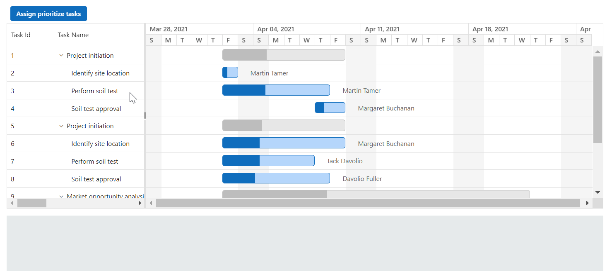
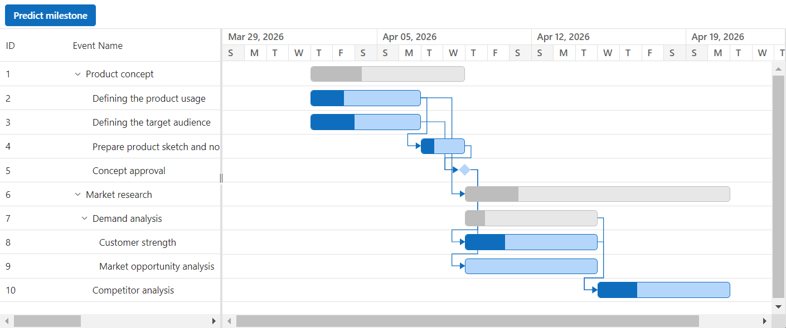
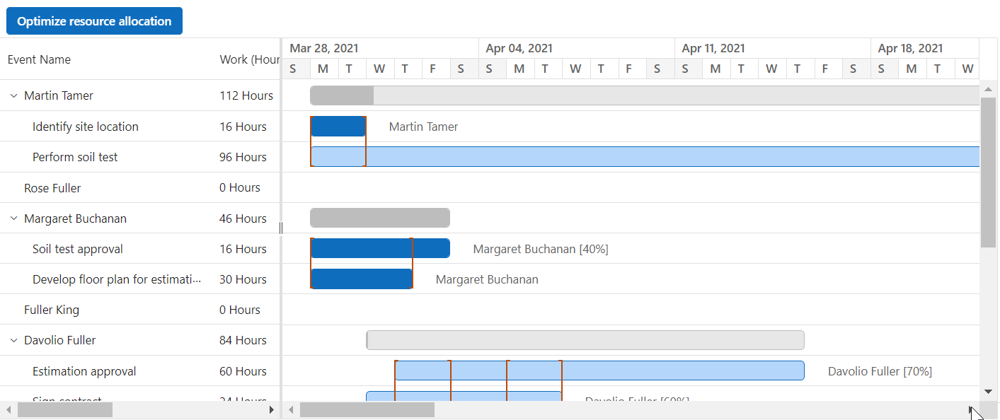

# Syncfusion Angular GanttChart AI Samples

This README provides an overview of the AI-driven features integrated into the Syncfusion Angular Gantt Chart. These features are designed to enhance project management by automating tasks such as prioritization, prediction, resource allocation, risk assessment, and scheduling.

## 1. Task Prioritize

### Sample Description

This sample demonstrates how AI can prioritize tasks within a task collection. The AI evaluates baseline dates and scheduled taskbar dates to identify critical tasks that are crucial for meeting project deadlines. It then reallocates resources to these critical tasks, ensuring efficient resource management and timely project completion.

### Action Description

The process begins with the AI identifying the critical tasks based on the project schedule. Following this, the AI generates another prompt to reassign resources and provides a summary of the reallocation and critical task details.

## 2. Progress Predictor

### Sample Description

This sample showcases how to predict milestone task completion and project end dates using AI-driven analysis within a Gantt Chart. The predictions are displayed as event markers, providing visual cues for upcoming milestones and the overall project timeline.

### Action Description

This functionality retrieves predicted milestone dates and the overall project completion date. The predictions are based on the current year's TaskCollection data, enhanced by analyzing historical TaskCollection data from the past five years.

## 3. Resource Allocator

### Sample Description

This sample demonstrates how to efficiently manage resource overallocation by reallocating available resources to tasks. It visually updates the Gantt Chart by changing the color of the taskbars to reflect the reallocated tasks, allowing for better tracking and management of resource usage. The process helps ensure that no single resource is overburdened, maintaining an optimized workflow.

### Action Description

The sample reallocates tasks to prevent resource overallocation. The reallocation process involves interacting with the TaskCollection, ResourceCollection, and AssignmentCollection to generate a new assignment collection. This new collection resolves any overallocated tasks by redistributing them within the same resource, ensuring balanced resource utilization. Taskbar colors are updated accordingly to indicate the changes in allocation, providing clear visual feedback on the resource adjustments.

## 4. Risk Assessor

### Sample Description

This sample demonstrates how to identify tasks at risk based on their duration and dependencies within the Angular Gantt Chart. Tasks that are determined to be critical are highlighted by dynamically changing their taskbar colors, making it easy to visualize potential risks in your project timeline.

### Action Description

This action identifies tasks that are at risk by analyzing their duration and dependencies, then highlights these tasks by applying distinctive colors to their taskbars.

## 5. Predictive Scheduling

### Sample Description

This sample demonstrates the predictive scheduling feature in the Syncfusion Angular Gantt Chart. It showcases how AI is utilized to forecast and schedule tasks based on historical data. The Gantt Chart displays taskbars with baselines, representing both the predicted schedule and the actual task timelines. The AI-driven prediction uses five years of historical task data alongside the current year's tasks to generate a comprehensive and accurate schedule, allowing users to visualize potential project timelines and adjust accordingly.

### Action Description

This action predicts and generates a task schedule by analyzing five years of historical TaskCollection data along with the current year's TaskCollection. The AI model processes this data to forecast future tasks, creating a predictive task collection. This collection is then visualized on the Gantt Chart, with baselines indicating the predicted start and end dates of each task, allowing users to compare the projected schedule with the actual progress.
