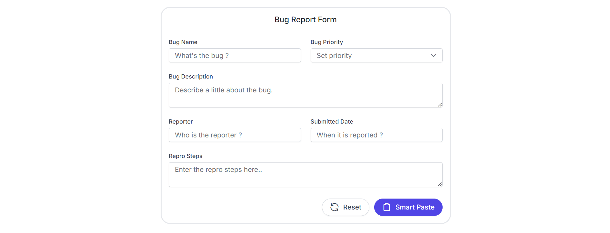

# Syncfusion Blazor Smart Paste Button Component

The `Smart Paste Button` is an advanced AI component built on top of Syncfusion's Button component. It inherits all the robust features and functionalities of the standard Syncfusion Button component while introducing an innovative intelligent pasting capability. This component leverages AI to intelligently paste clipboard data, ensuring that the pasted content is contextually relevant and formatted correctly.

By integrating the capabilities of AI, the `Smart Paste Button` goes beyond simple data insertion. It ensures that pasted content is contextually relevant and is ideal for applications where users frequently copy and paste data.



### Example Use Cases

* **Online Job Application**

   A job applicant could copy their resume or LinkedIn profile summary and click "Smart Paste" in the job application form. This would automatically populate fields such as "Work Experience", "Skills", "Education" and "Personal Statement", streamlining the application process and ensuring that all relevant information is included.

* **Bug Tracking Form**

   A user could copy a brief description of a bug from an Instant Messaging or chat message and then click "Smart Paste" on the "Create New Issue" page. The system would automatically populate fields like "Title", "Priority", "Description" and "Reproduce Steps" based on the clipboard content. The language model would also rephrase and structure the input as needed, converting phrases like "I clicked X on Y screen" into steps like "1. Navigate to screen Y, 2. Click X."

## Adding Syncfusion Smart Paste Button in Blazor

### Prerequisites

1. **Install the Syncfusion SmartComponents Package**

   Ensure that the `Syncfusion.Blazor.SmartComponents` NuGet package is installed in your Blazor project.

2. **Configure AI Services**

   To configure AI services, open your `Program.cs` file and add the following code. Replace the placeholders with your actual API credentials.

   ```csharp
   builder.Services.AddSyncfusionSmartComponents() // Inject SmartComponents
       .ConfigureCredentials(new AIServiceCredentials("your-apiKey", "your-deploymentName", "your-endpoint")) 
       .InjectOpenAIInference();
   ```
   
   **Using Ollama** 

   If you are using [Ollama](https://ollama.com/), set SelfHosted to true and provide the Endpoint URL where the model is hosted (e.g., http://localhost:11434). The value for DeploymentName should be the specific [model](https://ollama.com/library) you wish to use (e.g., `llama2:13b`, `mistral:7b`, etc.).

   ```csharp
   builder.Services.AddSyncfusionSmartComponents()
   .ConfigureCredentials(new AIServiceCredentials { SelfHosted=true, Endpoint= new Uri("Your self-hosted end point url") ,DeploymentName = "Your model name" })
   .InjectOpenAIInference();
   ```

   This configures the `Smart Paste Button` with AI-powered intelligent pasting capabilities.

### Adding the Smart Paste Button Component

Then, in a `.razor file`, inside any `<form>`, `<EditForm>` or `<SfDataForm>`, add the <SfSmartPasteButton> component. 

```razor
@page "/"
@using Syncfusion.Blazor.SmartComponents

<EditForm Model="@formModel">
    <p>Name: <InputText @bind-Value="@formModel.Name" /></p>
    <p>Address line 1: <InputText @bind-Value="@formModel.AddressLine1" /></p>
    <p>City: <InputText @bind-Value="@formModel.City" /></p>
    <p>Zip/postal code: <InputText @bind-Value="@formModel.Zip" /></p>

    <button type="submit">Submit</button>
    <SfSmartPasteButton>Smart Paste</SfSmartPasteButton>
</EditForm>

@code {
    private FormModel formModel = new FormModel();

    public class FormModel
    {
        public string? Name { get; set; }
        public string? AddressLine1 { get; set; }
        public string? City { get; set; }
        public string? Zip { get; set; }
    }
}
```

## Customizing the Syncfusion Smart Paste Button

`Smart Paste Button` inherits all functionalities and properties from the `Syncfusion Button component`. This means you can use all the properties and customization options available for the Button in the `Smart Paste Button` as well.

For more information and a detailed guide on using these properties, refer to the official [Button Documentation](https://blazor.syncfusion.com/documentation/button/getting-started).

## Annotating Your Form Fields

`Smart Paste Button` automatically identifies form fields in your `<form>` elements (i.e., `<input>`, `<select>`, and `<textarea>` elements) and generates descriptions based on their associated `<label>`, `name` attributes, or nearby text content. This description is then used to build a prompt for the language model.

You can override these default descriptions for specific form fields by adding a `data-smartpaste-description` attribute. Here are some examples:

```html
<input data-smartpaste-description="The user's vehicle registration number, formatted as XYZ-123" />

<textarea data-smartpaste-description="The job description should start with JOB TITLE in all caps, followed by a paragraph of text"></textarea>

<input type="checkbox" data-smartpaste-description="Check if the product description indicates suitability for children; otherwise, uncheck" />
```

Customizing these descriptions allows you to provide more specific instructions to the language model, which can improve the accuracy and relevance of the generated field values. Keep in mind that language models can produce varied outputs, and effective prompt engineering may require some experimentation to achieve the best results for your specific use case.
