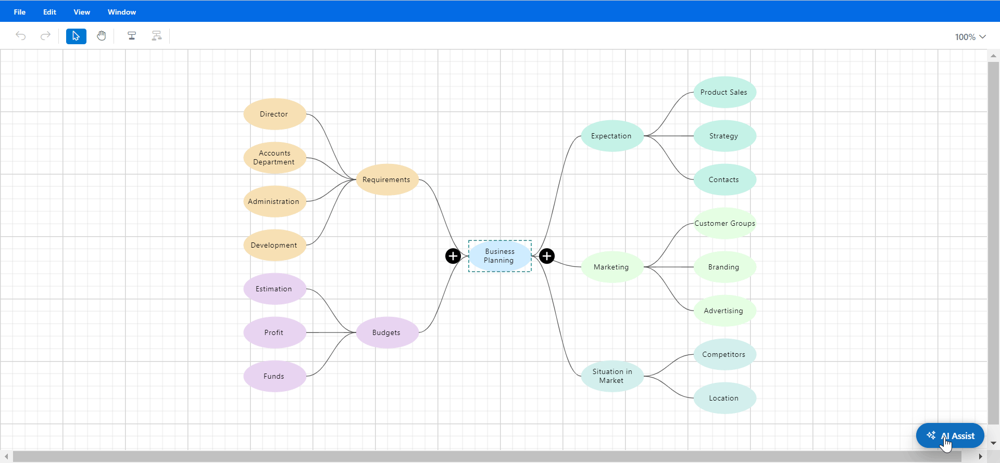
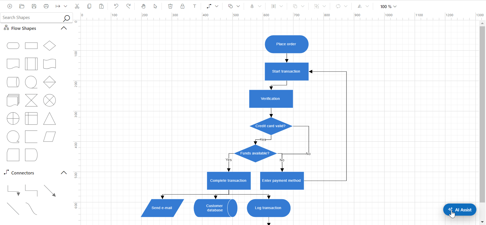

# Syncfusion React Diagram component AI Samples

This README provides an overview of the AI-driven features integrated into the Syncfusion React Diagram component. These features enhance diagram creation by leveraging AI to dynamically generate content, facilitating the visualization of complex information, processes, and workflows.

## 1. TextToMindMap

### Sample Description

This demo showcases the creation of a dynamic mindmap diagram using the Diagram component with the assistance of AI. The AI-powered diagram features nodes and connectors arranged in a mindmap layout, designed to visually organize and represent ideas and concepts. This sample is ideal for brainstorming, organizing thoughts, and visually mapping out complex information. The context menu allows for quick actions such as adding, editing, or deleting nodes, making it a powerful tool for interactively managing and expanding mindmaps.

### Action Description

This sample leverages a specialized AI prompt, allowing users to generate the content of the diagram by submitting a prompt to OpenAI. The AI's response is parsed and transformed into nodes and connectors, visually representing the generated ideas or concepts in a mindmap format. Users can also manually add child nodes using user handles to further expand and customize the mindmap, creating an interactive and personalized experience.

## 2. TextToFlowChart

### Sample Description

This demo illustrates the creation of a flowchart diagram using the Diagram component with the assistance of AI. The AI-powered flowchart is structured with nodes and connectors arranged in a flowchart layout, designed to visually represent processes and workflows. This sample is particularly effective for visualizing step-by-step procedures, workflows, and decision-making paths in a clear and interactive manner.

### Action Description

This sample leverages a specialized AI prompt to create a dynamic flowchart diagram by submitting a request to OpenAI. The AI-generated response is parsed to produce nodes and connectors arranged in a flowchart layout, visually representing the defined processes or workflows. Users can generate and visualize the flowchart content based on their input prompt, creating an interactive and organized depiction of processes and decision-making paths.