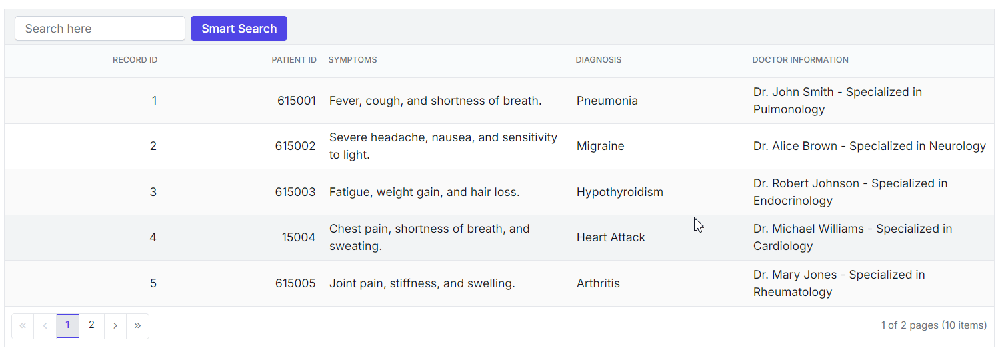

# Syncfusion React DataGrid AI Samples

This README provides an overview of the AI-driven features integrated into the Syncfusion DataGrid. These features enhance data interaction by leveraging AI capabilities to enable semantic filtering and anomaly detection.

## 1. Semantic Filtering

### Sample Description

This sample demonstrates how the Syncfusion DataGrid, integrated with AI, supports Semantic Search. The DataGrid displays diagnostic information from medical reports and uses AI to enhance search functionality.

### Action Description

- **Semantic Search**: In this example, the DataGrid allows users to search for related information without needing to enter the exact word. For instance, even if the DataGrid lists "Abdominal pain," it can show relevant reports when searching for "stomach" instead of the exact term. The grid dynamically displays related search results using AI, improving search accuracy and relevance.

## 2. Anomaly Detection

### Sample Description

This sample demonstrates how the Syncfusion DataGrid, enhanced with AI, can detect anomalies within its data.

### Action Description

- **Anomaly Detection**: In this example, the DataGrid displays details like Machine ID, Voltage, Pressure, Temperature, Motor Speed, and Production Rate. AI analyzes this data to identify unusual points and provides explanations for why they are considered anomalies. When you press the "Detect Anomaly" button, the grid updates to display the anomaly details, helping users identify and address data inconsistencies.
