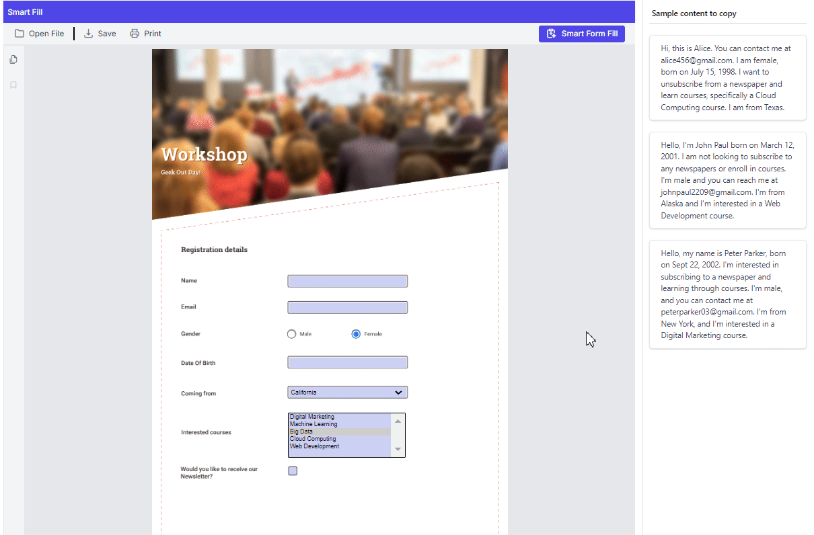

# Syncfusion React PDF Viewer AI Samples

PDF Viewer AI samples requires web service.

## Before running the sample, Run the web service and ensure you enter the valid keys in the following files:

### Prerequisites

[System requirements for running ASP.NET Core web service](https://ej2.syncfusion.com/aspnetcore/documentation/system-requirements)

### configure AI key in the web service

- Run the Webservice `EJ2APIServices_NET8.sln` file. You can find the solution file from this `src/ai-components/pdfviewer/Webservice/EJ2APIServices_NET8.sln` location.

- Paste the pdfviewer service url in the name `webservice_localhost` is present in the `smartfill.tsx`, `smartredact.tsx` and `summarizer.tsx`  file.

```
// Replace the SERVICE_URL with your local host
const SERVICE_URL: string = 'webservice_localhost/api/pdfviewer';

Example:
const SERVICE_URL: string = 'http://localhost:62870/api/pdfviewer';
```

- In `src/ai-components/pdfviewer/Webservice/src/SemanticKernel.cs`, add your endpoint and deployment name.
 
  

- In `src/ai-components/pdfviewer/Webservice/controllers/PdfviewerController.cs`, add your Azure OpenAI key. In the below function you have to enter the Key

   

## 1. Smart Fill - AI-Powered Form Auto-Fill

### Sample Description

This sample illustrates how the Syncfusion React PDF Viewer, with AI assistance, can automatically fill form fields using content copied by the user. It improves efficiency and reduces errors by automating the form-filling process.

- **Automatic Form Filling**: AI processes copied content and automatically populates the relevant fields in the PDF form.
- **Manual Review**: Users can review and adjust the filled fields as necessary to ensure accuracy.



### Action Description

When users copy content, the AI intelligently matches the content to the relevant form fields in the PDF. The fields are automatically populated, reducing manual entry and improving efficiency. Users can review the filled fields and make adjustments as needed.

## 2. Smart Redaction - AI-Assisted Document Redaction

### Sample Description

This sample demonstrates how the Syncfusion React PDF Viewer can intelligently redact sensitive information using AI. The system can detect and redact specific patterns like emails or names to protect private data.

- **Smart Redaction**: AI detects and redacts sensitive information based on patterns like emails or names.
- **Review and Adjustment**: Users can review and deselect any non-sensitive information identified by the AI before proceeding with redaction.


### Action Description

The AI assists in identifying and redacting sensitive content. Users can review the detected patterns and customize the redaction process by manually selecting or deselecting specific information. This feature ensures efficient yet controlled protection of sensitive data in PDF documents.

## 3. Document Summarization - AI-Powered PDF Summarization and Q&A

### Sample Description

This sample showcases how the Syncfusion React PDF Viewer can intelligently perform PDF summarization and Q&A. Users can generate a summary of the document and ask questions based on its content, streamlining the understanding of complex documents.

- **PDF Summarization**: Generates a detailed summary of the PDF document, highlighting key points.
- **Q&A Functionality**: Allows users to ask questions about the document’s content, with options for both custom queries and AI-generated suggestions.
- **Reference Page Navigation**: Automatically directs users to relevant pages in the document based on their queries.


### Action Description

Users can click the "AI AssistView" button to obtain a summary of the PDF. After generating the summary, they can ask questions either by inputting their own queries or selecting from AI-generated suggestions. The tool identifies the relevant content and navigates the user to the appropriate pages within the document for efficient information retrieval.
